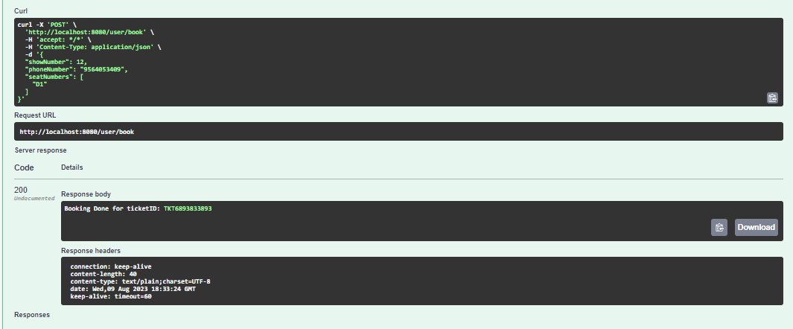

# Booking show System
This is a case study for booking show.
Created By: Apurba Panda
Contact: 9564053407

## Setup
To Run: bootrun --args='--spring.profiles.active=dev'

## DB Details
H2-Console: http://localhost:8080/
URL: jdbc:h2:mem:booking-show
username: apurba

## API Usage (Swagger UI Documentation)
Please check image directory for more details.

Swagger home: http://localhost:8080/swagger-ui/index.html#/

Admin -> setup show

User -> Check Available Seat

User -> Book Ticket 

User --> Trying to book already booked ticket 

User --> Trying to book ticket with used phone number 

Admin --> View

User --> cancel booking with invalid ticketId

User --> Cancellation Window Expired

user --> Successfully cancel 

